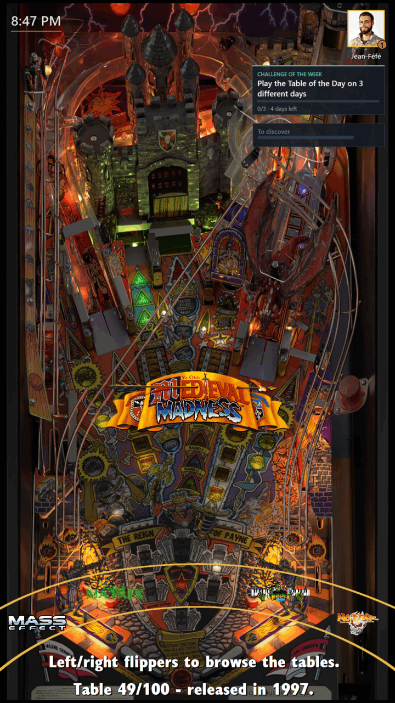
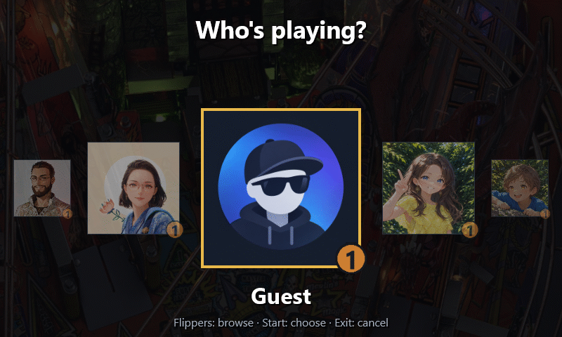
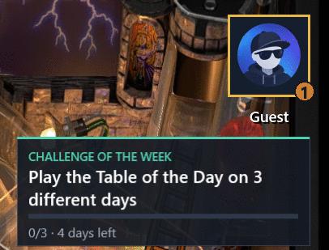
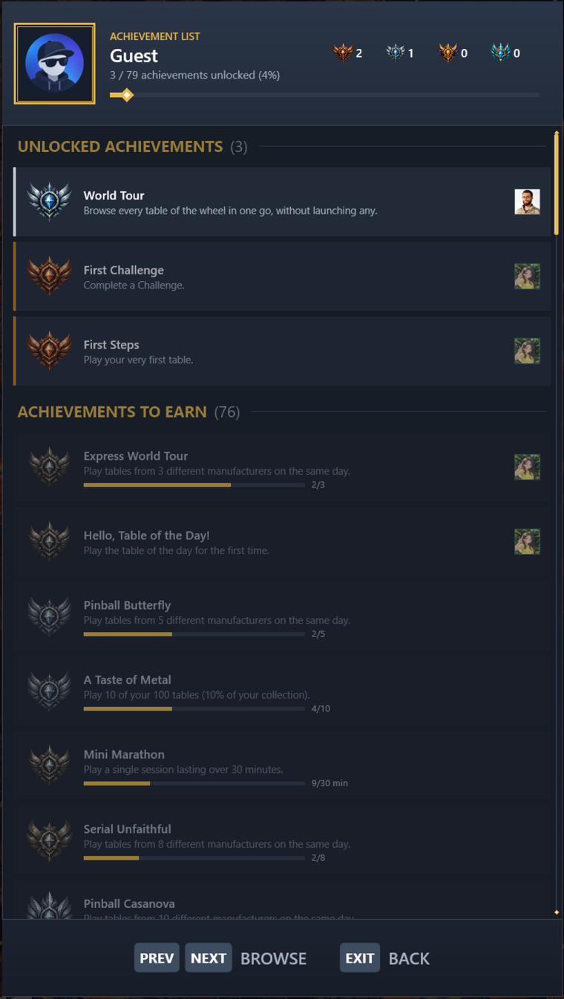
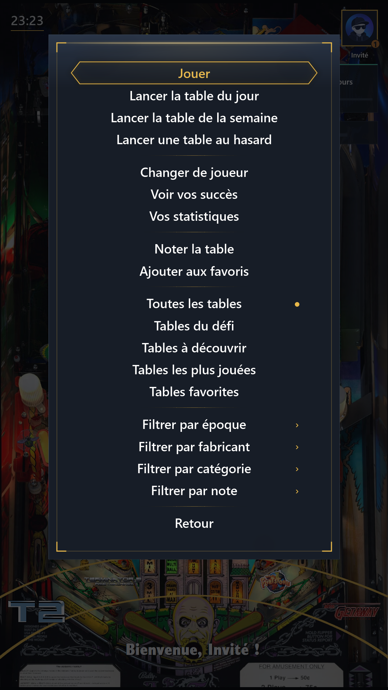

# PinballY Expansion Pack

An unofficial extension of [PinballY](http://mjrnet.org/pinscape/PinballY.php), written with the JavaScript scripting API that PinballY opens to every developer. · *[Version française](README.fr.md)*

> **Give everyone in the house a real reason to come back to your pincab.** A Profile with an Avatar for each of you, a Table of the Day, weekly Challenges, Achievements from Bronze to Platinum (a few of them secret), your own stats, and PinballY itself in French, German, Spanish, Italian or Portuguese: everything PinballY was missing, without touching PinballY. And this is only the beginning…



### A Profile for everyone



With Change Player, each of you picks your own Profile and Avatar, and a greeting shows whose games will count. **Your Stats** sums up your pinball life: games played, total time, favourite manufacturer and decade, most played and never played tables, how much of the collection you have tried, and your Streaks. Only games of at least a minute count, so a launch by mistake never spoils them. Guest is always there for visitors.

### Table of the Day, Table of the Week


Every day there is a table you have never played or long forgotten, and every week a random one. Both are offered right at startup. Play them several days or weeks in a row to build a Streak.

### Weekly Challenges



A new Challenge comes every Monday, the same for the whole household: five different Stern tables, three tables you have never played, an hour on a single table... Its card on the wheel screen tracks your progress. **Challenge Tables**, right under "All Tables" in the main menu, keeps only the tables that would move it forward. Completing it brings a shower of confetti across the wheel screen.

### Achievements



There are dozens of Achievements, from Bronze to Platinum: manufacturers and decades completed, hours played, Streaks, Challenges, a full tour of the wheel... Each one is announced by a small toast in a corner, without interrupting your games; a Platinum also brings a shower of confetti across the wheel screen. The Achievement List shows how far you are from each missing one, and which of the household's Avatars already have it. A few stay secret, shown as "???" with a hint, until you stumble upon them.

### PinballY in 6 languages



PinballY's own menus and messages in French, German, Spanish, Italian or Portuguese.

### For the cabinet owner

- **Admin Profile**: the setup entries for you alone.
- **Child Profile**: a wheel without Adult Tables for the kids.
- **Profile Reset**: start a Profile over, or the whole household at once.
- **Menu Cleanup**: leaner PinballY menus.

Everything stays in one folder, with no change to PinballY itself.

**And also**:
- a Random Game spun on a wheel of fortune;
- "Tables to Discover", "Most Played Tables", "Favorite Tables" and "Original Tables" in the menus;
- a clock, a gold arc under the wheel and a richer status line;
- a reminder to rate a table;
- launches without a black flash;
- the backglass hidden during a game;
- sounds for launches, Achievements, greetings, confetti and fireworks, or your own.

## Install

Requires **Windows** and **PinballY 1.1.0 Beta 10** or later (plus the *Windows Media Player* optional feature, for the sounds).

1. **Copy the project into `PinballY\Scripts\ExpansionPack`**, under that exact name: the pack looks for its files there. From a downloaded zip, rename the extracted folder (`PinballY-Expansion-Pack-main`) to `ExpansionPack`; with git, run `git clone https://github.com/F3L1X79/PinballY-Expansion-Pack.git ExpansionPack` from `PinballY\Scripts`.
2. **Add this line to `PinballY\Scripts\main.js`**, or create the file with only this line if you have none:
   ```js
   import "./ExpansionPack/main.js";
   ```
   Your own scripts keep running: nothing else in `Scripts` is touched.
3. **Copy `ExpansionPack\.env.example` to `ExpansionPack\.env.local`** and set what you need, one `KEY=value` per line (UTF-8). Missing settings keep their default; `.env.local` is ignored by git.
4. **Restart PinballY** and check `PinballY.log`: it lists your overrides, one "initialized" line per add-on, and `ERROR` lines naming the add-on at fault.

Everything the pack keeps stays in `Scripts\ExpansionPack`: your settings (`.env.local`) and each Profile's progress (`profiles`). **To back up**, copy that folder. **To uninstall**, delete it and remove the import line from `Scripts\main.js`.

## Settings

Settings live in `Scripts\ExpansionPack\.env.local`, one `KEY=value` per line. Only write the ones you change, for example:

```
LANGUAGE=en
ACHIEVEMENT_SOUND_FILE=assets\sounds\local\trophy.mp3
ADD_ON_CLOCK=false
```

| Setting | Default | What it does |
|---|---|---|
| `LANGUAGE` | `en` | Interface language: `en`, `fr`, `de`, `es`, `it` or `pt`. |
| `ADULT_CATEGORY` | `NSFW` | PinballY category of the Adult Tables, hidden from Child Profiles. |
| `COMMUNITY_TABLES_MANUFACTURER` | `VPX Community` | Manufacturer you gave to fictional or community tables, for the status line and the "Original Tables" filter. |
| `LAUNCH_SOUND_FILE` | `assets\sounds\launch.mp3` | Sound played when a table launches: a path from the pack's folder (your own sounds go in `assets\sounds\local\`) or a full path; empty = no sound. |
| `ACHIEVEMENT_SOUND_FILE` | `assets\sounds\achievement.wav` | Sound played with each Achievement toast. |
| `PROFILE_GREETING_SOUND_FILE` | `assets\sounds\profile_greeting.mp3` | Sound played when a player is greeted. |
| `CONFETTI_SOUND_FILE` | `assets\sounds\confetti.wav` | Sound played once when a shower of confetti starts. |
| `FIREWORKS_SOUND_FILE` | `assets\sounds\fireworks.wav` | Sound played once when the Fireworks start. |
| `ACHIEVEMENT_TOAST_SECONDS` | `4` | Seconds an Achievement toast stays on screen (up to 60). |
| `ACHIEVEMENT_TOAST_SCALE` | `1.0` | Size of the toast, from `0.5` to `3`. Raise it on a large screen. |
| `CONFETTI` | `true` | `false` turns off the Confetti Shower that falls with the toast of a completed Challenge or a Platinum Achievement, if your PC struggles with it. |
| `FIREWORKS` | `true` | `false` turns off the Fireworks that come with the toast of a new Player Level, if your PC struggles with them. Independent of `CONFETTI`. |
| `SKIP_RANDOM_GAME_ANIMATION` | `false` | `true` skips the wheel of fortune and launches the Random Game at once. |
| `ASK_TO_RATE_AFTER_MINUTES_PLAYED` | `60` | Minutes played on a table before you are asked to rate it. |
| `LOG_UNTRANSLATED_MENU_TITLES` | `false` | `true` writes each untranslated PinballY menu title to `PinballY.log`. |

Every feature can also be turned off with its `ADD_ON_*` key, for example `ADD_ON_CLOCK=false` or `ADD_ON_CHALLENGES=false`. Only Menu Cleanup is off by default. Each key is described in [.env.example](.env.example).

Each Profile's progress is saved in `Scripts\ExpansionPack\profiles`. Keep that folder when you reinstall or update the pack, and you get your progress back.

### Admin Profile

To keep the setup entries for yourself, add `"isAdmin": true` at the top level of your Profile's `Scripts\ExpansionPack\profiles\<name>\profile.json`, PinballY closed. Once at least one Profile is marked, the other Profiles (Guest included) no longer see "Table Setup" in the main menu nor "Operator Menu" in the Exit menu; the Admin Profiles still see both, and the coin door service button still opens the Operator Menu for anyone. Several Profiles can be marked. Guest is never an Admin Profile, and a mark that is not `true` or `false`, or whose key is misspelt (`"isAdmin "`, `"IsAdmin"`), is ignored and logged in `PinballY.log`.

An Admin Profile also finds **Reset profile** in the Exit menu (Escape), right after "Operator Menu". It lists every Profile, Guest and yourself included, plus "Every profile" to reset the whole household at once. After one confirmation (the cursor starts on "No"), the chosen Profile starts over as if it had never played: its plays, Streaks, session records, Random Games, Challenge progress and announced Achievements are erased, while its name, Avatar and marks stay. A message then tells whether it worked. Its former file is kept next to it as `profile.reset-<date>.json`: to undo a reset, close PinballY and rename that copy back to `profile.json`. Reset profile needs PinballY's Exit menu: if you disabled it in PinballY's options, the entry cannot show.

### Child Profile

To keep the Adult Tables away from a child, tag them in PinballY with the category `NSFW` (or name your own category with `ADULT_CATEGORY` in `Scripts\ExpansionPack\.env.local`, spelt exactly as in PinballY), then add `"isChild": true` at the top level of the child's `Scripts\ExpansionPack\profiles\<name>\profile.json`, PinballY closed. While that Profile is active, those tables are on the wheel under no filter, the Random Game never draws one, and starting up never leaves the wheel on one; switching to another Profile brings them back at once. The Table of the Day and the Table of the Week stay the same for the whole household: while one is an Adult Table, the child gets neither its main menu entry nor its startup choice, and that day or week neither extends nor breaks the child's Streak. Guest is never a Child Profile, so adult visitors see the whole collection. This is no parental control: nothing asks for a password.

### Menu Cleanup

Menu Cleanup lightens PinballY's menus for every Profile, Admin Profiles included: it removes Help and About from the Exit menu, and Information, Flyer, High Scores and Instruction Card from the main menu (Rate Table and Add to Favorites stay). It is the only feature **off by default**: turn it on with `ADD_ON_MENU_CLEANUP=true`. PinballY's dedicated buttons for these screens, if you mapped them, still work.

## Contributing

Module layout, conventions, tests, adding a language and resetting progress: see the [contributor guide](CONTRIBUTING.md).

## License

MIT. See [LICENSE](LICENSE).
